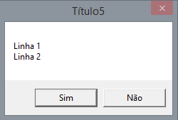

# devcpp-ptbr-criarjanelasdeaviso-unb-tutorial
Tutorial de como criar janelas de aviso e pergunta de forma simples no Dev C++(5.11)

MessageBox( 0, "Linha 1\nLinha 2", "Título11", 0 | MB_ICONERROR );

MessageBox( 0, "Linha 1\nLinha 2", "Título10", 0 | MB_ICONQUESTION );

MessageBox( 0, "Linha 1\nLinha 2", "Título8", 0 | MB_ICONINFORMATION );

MessageBox( 0, "Linha 1\nLinha 2", "Título7", 0 | MB_ICONEXCLAMATION );

MessageBox( 0, "Linha 1\nLinha 2", "Título5", MB_YESNO );

MessageBox( 0, "Linha 1\nLinha 2", "Título1", 0);

janelas.cpp é uma arquivo com exemplos.
fonte:https://docs.microsoft.com/en-us/windows/win32/api/winuser/nf-winuser-messagebox
